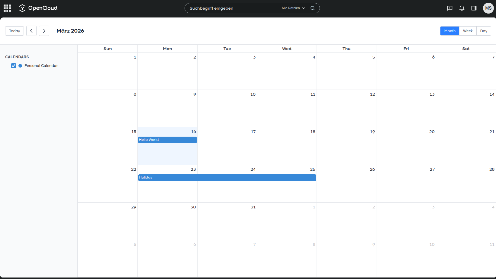

# Calendar for OpenCloud

A CalDAV calendar application integrated as a native [OpenCloud](https://opencloud.eu/) web extension. View, create, edit and manage calendar events directly within OpenCloud.



## Features

- CalDAV integration with OpenCloud backend
- Month, week and day views
- Create, edit and delete calendar events
- Drag & drop event rescheduling
- Multiple calendar support with color coding
- All-day and timed events
- Event conflict detection and resolution
- Auto-save with optimistic updates

## Installation

1. Download the latest release archive from the [Releases](https://github.com/mschneider82/opencloud-web-calendar/releases) page.
2. Extract the archive into your OpenCloud web assets directory:
   ```bash
   unzip web-app-calendar.zip -d /var/lib/opencloud/web/assets/apps/web-calendar/
   ```
3. Restart OpenCloud to pick up the new extension.

## Development

### Prerequisites

- [Node.js](https://nodejs.org/) >= 22
- [pnpm](https://pnpm.io/installation) (see `packageManager` field in `package.json` for the exact version)
- Docker and Docker Compose (for local dev server)

### Setup

```bash
pnpm install
pnpm build:w
```

### Local Development Server

```bash
docker compose up
```

Then open `https://host.docker.internal:9200` (default credentials: `admin`/`admin`).

### Build for Production

```bash
pnpm build
```

The production build is output to the `dist/` directory.

### Testing

```bash
pnpm test:unit
```

## Architecture

The application is built with:

- **Vue 3** with Composition API
- **FullCalendar** for calendar rendering
- **CalDAV** protocol for calendar synchronization
- **ical.js** for iCalendar parsing and generation
- **Tailwind CSS** for styling

### Key Components

- `CalendarView.vue` - Main calendar component using FullCalendar
- `CalendarToolbar.vue` - Navigation and view switching controls
- `CalendarSidebar.vue` - Calendar list with visibility toggles
- `EventDialog.vue` - Event creation and editing modal

### Composables

- `useCalendars` - Calendar list management
- `useEvents` - Event fetching and caching
- `useEventEditor` - Event creation/editing state machine

### CalDAV Integration

The CalDAV client (`src/caldav/client.ts`) handles:
- Calendar discovery via PROPFIND
- Event fetching via REPORT
- Event creation, updates and deletion via PUT/DELETE
- ETag-based conflict detection

## License

[Apache-2.0](LICENSE)
